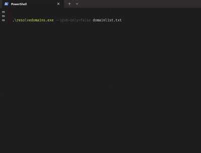

## Resolve domains 
Asynchronous dns resolver written in python (30 threads)

## Python Example:
```python
cat domainlist.txt | python3 resolvedomains.py > ip_addresses
```

## Ruby Example:
```ruby
cat domainlist.txt | ruby resolvedomains.rb > ip_addresses
# useful for bbrf
cat domainlist.txt | ruby resolvedomains.rb -v > ips_hosts 
```

```bash
$ awk '{print $1}' ip_addresses_verbose > resolved_hosts
$ awk '{print $2}' ip_addresses_verbose > ip_addresses
```

## Go Exemple:

### Usage exemple



#### Compile the resolvedomains.go file:

$ go build -o resolvedomains.exe resolvedomains.go

```go
$ cat domainlist.txt | go run .\resolvedomains.go
or if you compile:
$ resolvedomains.exe domainlist.txt
```